# Bluetooth Issue Report Dashboard (BTIRD)

A dashboard for collecting, visualizing, and reporting Bluetooth issue data.
The project provides both backend and frontend components, supports containerized deployment, and is designed to streamline Bluetooth testing and debugging workflows.

---

## ✨ Key Features

- **Issue Tracking & Logging**Store and organize Bluetooth-related test results and logs.
- **Manage logs**Once the logs are updated to the database, we can manage the log in this dashboard.
- **Data Visualization**Frontend dashboards to plot **Bluetooth Driver Reliability**, **Integration Test**, **Platform Summary**, **WLAN Reliability**, and other metrices.
- **Excel & Report Export**Generate structured reports for further analysis or sharing.
- **Containerized Deployment**
  Podman Compose files are included for running services consistently across environments.

---

## 📂 Project Structure

```
Bluetooth-Issue-Report-Dashboard/
├── backend/                 # Backend services and APIs
├── frontend/                # Frontend dashboard (UI)
├── db_backups/              # Database backup files
├── scripts/                 # Helper scripts (**Not yet**)
├── .github/workflows/       # CI/CD configurations (**Not yet**)
├── podman-compose.dev.yml   # Dev environment config
├── podman-compose.prod.yml  # Prod environment config
└── README.md
```

---

## 🚀 Getting Started

### 1. Clone the repository

```bash
git clone https://github.com/kirtox/Bluetooth-Issue-Report-Dashboard.git
cd Bluetooth-Issue-Report-Dashboard
```

### 2. Podman Compose Commands by PowerShell

For development:

```bash
# Run in PowerShell window
podman-compose -p btird_dev -f podman-compose.dev.yml up --build

# Stop
podman-compose -p btird_dev -f podman-compose.dev.yml down
```

For production:

```bash
# Run in background
podman-compose -p btird_prod -f podman-compose.prod.yml up --build -d

# Stop
podman-compose -p btird_prod -f podman-compose.prod.yml down
```

For checking current status of each podman container:

```bash
podman ps
```

### 3. Production Environment Setup

In production, make sure to configure firewall rules and port forwarding:

#### 🔥 Firewall

Allow inbound traffic on ports **8001** and **5174**.

#### 🔀 Port Proxy (Windows)

Run the following commands in an **PowerShell / CMD**:

```bash
# Add NAT
netsh interface portproxy add v4tov4 listenaddress=myIP listenport=5174 connectaddress=127.0.0.1 connectport=5174
netsh interface portproxy add v4tov4 listenaddress=myIP listenport=8001 connectaddress=127.0.0.1 connectport=8001

# Remove NAT
netsh interface portproxy delete v4tov4 listenaddress=myIP listenport=5174
netsh interface portproxy delete v4tov4 listenaddress=myIP listenport=8001

# Check NAT table
netsh interface portproxy show all
```

This allows external devices on your LAN to access the dashboard services through the host machine.

>  If the podman compose didn't work successfully, the below steps should be work.

```
# Activate the services in order
podman-compose -p btird_prod -f .\podman-compose.prod.yml up -d db
# Wait the db check successfully
podman-compose -p btird_prod -f .\podman-compose.prod.yml up -d backend
# Wait the backend activating
podman-compose -p btird_prod -f .\podman-compose.prod.yml up -d frontend
```

---

## 🛠️ Tech Stack

- **Backend**: Python (FastAPI / Flask style services)
- **Frontend**: React + TypeScript + Recharts (for visualizations)
- **Database**: PostgreSQL (with backup support)
- **Deployment**: Podman Compose
- **CI/CD**: GitHub Actions (**Not yet**)

---

## 📊 Example Use Cases

- Collect trace logs and visualize dynamic charts over time.
- Generate **Excel reports** for test results.

---

## 🔐 User Roles & Permissions

The dashboard implements a role-based access control system with three user roles:

### Administrator

- Full access to all features
- Can create, edit, and delete any report
- Can manage user accounts
- Can view API access logs
- Can manage platform configurations
- Can export reports

### User

- Can view all reports
- Can create new reports (operator name automatically set to username)
- Can edit and delete only their own reports (where `op_name` matches their username)
- Can export reports
- Can edit their own profile

### Guest

- Read-only access
- Can view reports and dashboards
- Cannot create, edit, or delete reports
- Cannot export reports
- Cannot access user management or logs

### 🖼️ Screenshots

> *Profile will display some information about the user.*
>
> *And only **admin** role can see the **User Management** and **Logs** in sidebar.*

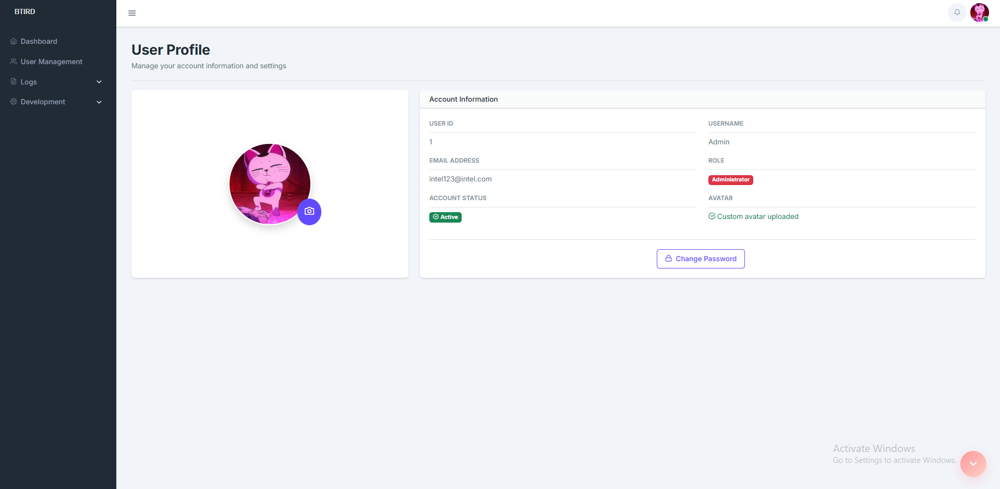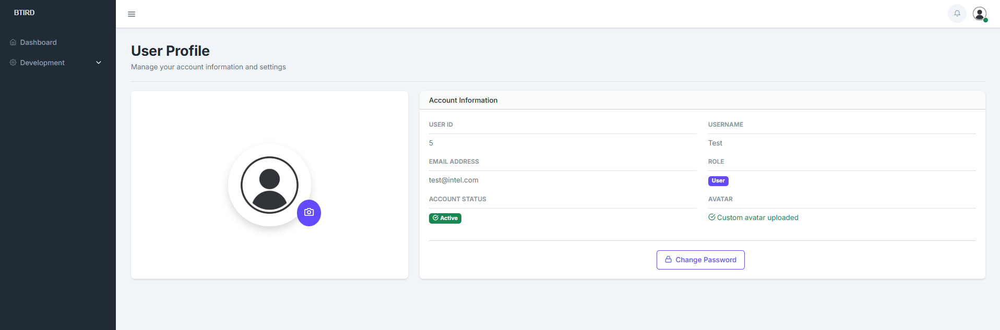

> *User Management - Admin can manage all the user.*

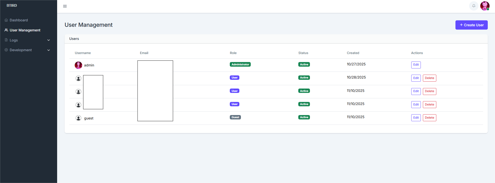

---

## 🖼️ System Screenshots

> _Homepage – Display platforms summary, platforms status, report table, gauge charts, bar charts._

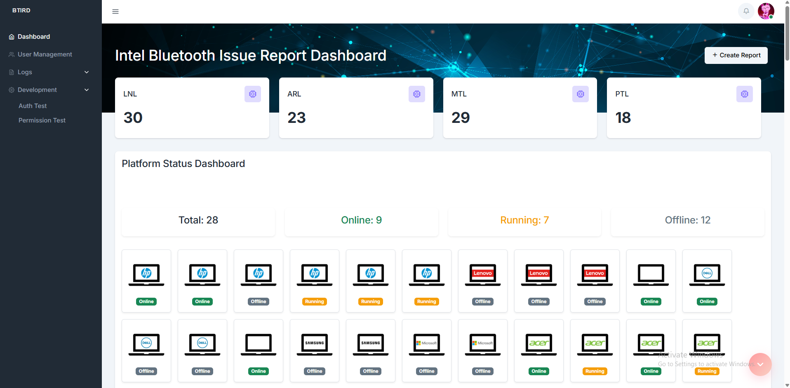

> *Report table and filters – Display platforms summary, platforms status, report table, gauge charts, bar charts.*

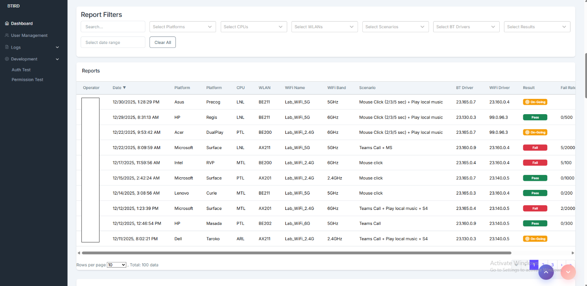

> *Table Summary – Summarized each selected conditions based on the duration of data. (Also follow the filter conditions)*

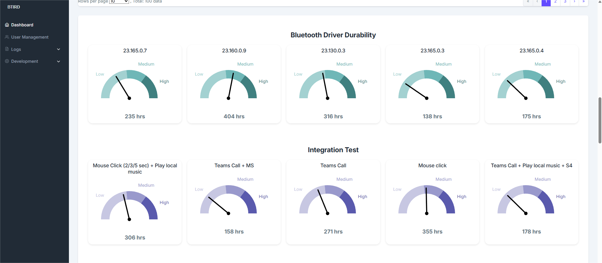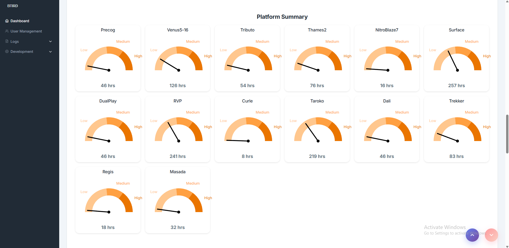

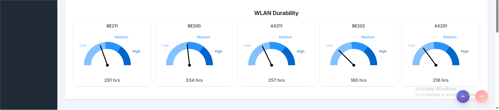

> *Reliability Summary – Summarized across different conditions based on the number of data. (Also follow the filter conditions)*

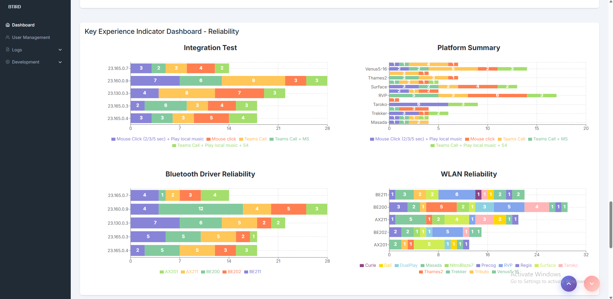

> *Durability Summary – Summarized across different conditions based on the duration of data. (Also follow the filter conditions)*

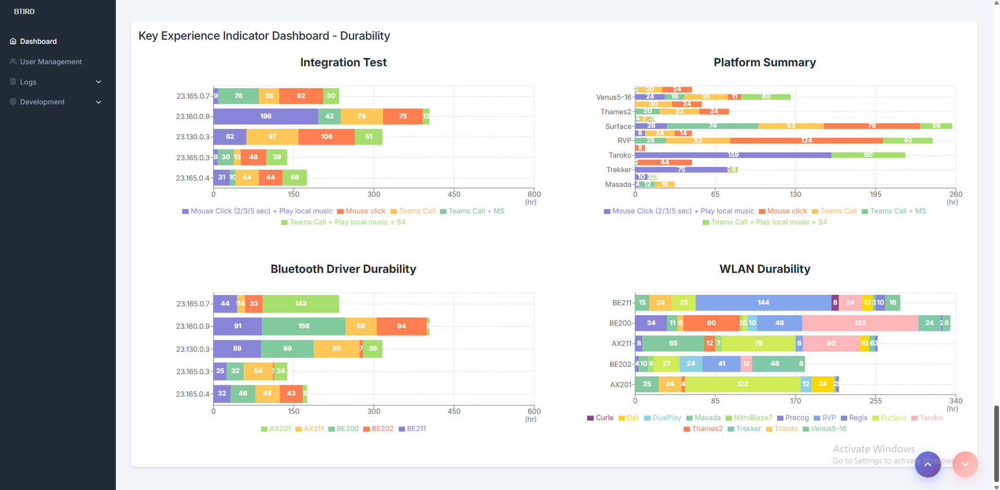

> *Create report - In case there is necessary to create report manually.*

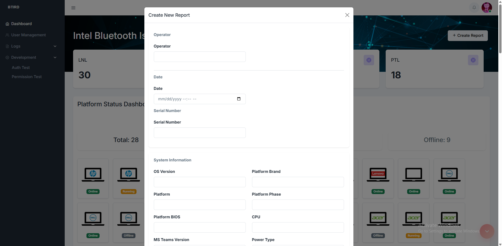
